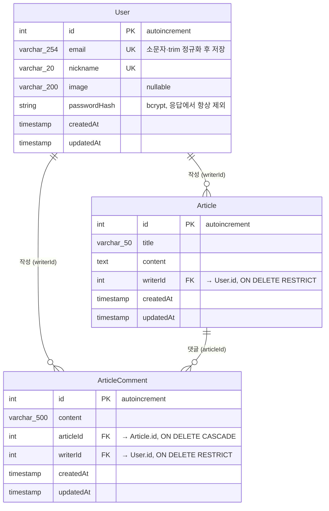
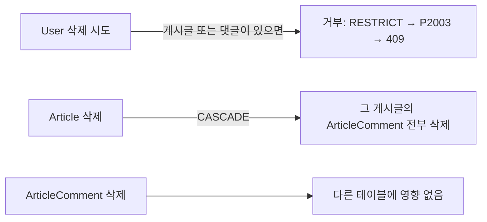
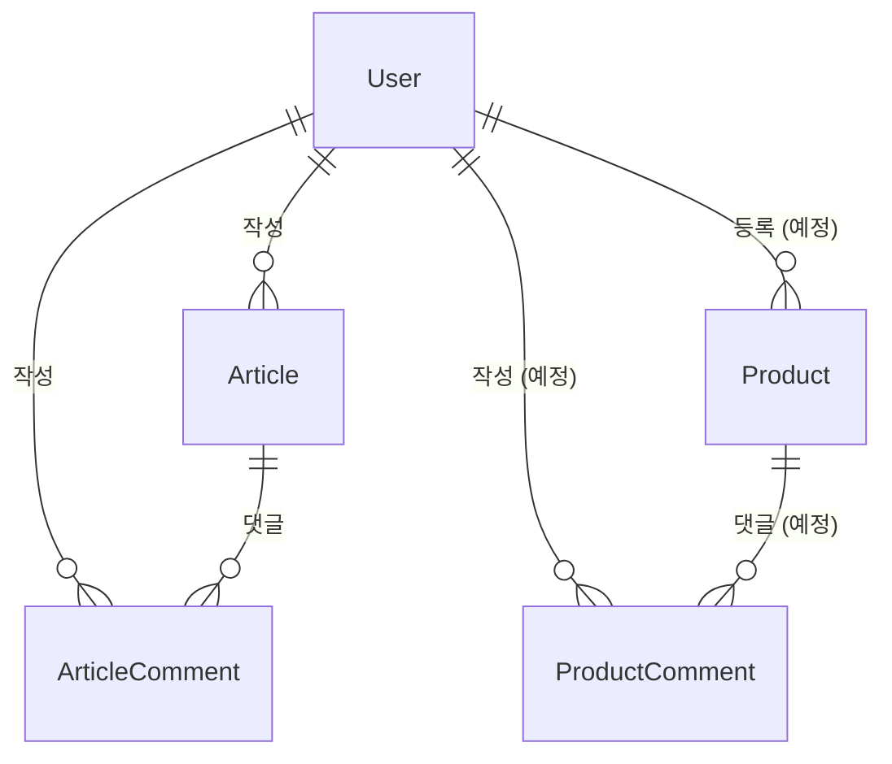

# DB 스키마 · 관계도

> 기준: `prisma/schema.prisma` (마이그레이션 `20261008093732_add_article_comment`까지)
> 설계 결정의 이유는 `docs/adr/` 참고
> DB: PostgreSQL 17 · ORM: Prisma 7
> 아래 다이어그램은 Mermaid 문법이에요. GitHub, VS Code(Mermaid 확장), mermaid.live 등에서 그림으로 보여요.

---

## 1. 전체 관계도 (ERD)



### 기호 읽는 법

| 기호 | 뜻 |
|---|---|
| `\|\|` | 정확히 1 (반드시 하나) |
| `o{` | 0개 이상 (없을 수도, 여러 개일 수도) |
| `User \|\|--o{ Article` | 사용자 1명은 게시글을 **0개 이상** 쓰고, 게시글 1개는 **반드시 1명**의 작성자가 있어요 |
| PK | 기본 키 (Primary Key) |
| FK | 외래 키 (Foreign Key) |
| UK | 유일 값 (Unique Key) |

---

## 2. 관계 요약

| 관계 | 종류 | 외래 키 | 부모 삭제 시 | 필수 여부 |
|---|---|---|---|---|
| User → Article | 1 : N | `Article.writerId` | **RESTRICT** (게시글이 있으면 사용자 삭제 거부) | 필수 |
| User → ArticleComment | 1 : N | `ArticleComment.writerId` | **RESTRICT** | 필수 |
| Article → ArticleComment | 1 : N | `ArticleComment.articleId` | **CASCADE** (게시글을 지우면 댓글도 삭제) | 필수 |

세 관계 모두 `ON UPDATE CASCADE`예요. 부모의 id가 바뀌면 자식의 외래 키도 따라 바뀌지만, 우리 id는 autoincrement라 바뀔 일이 없어요.

---

## 3. 삭제가 퍼지는 방식



- **사용자는 지우지 않아요.** 회원 탈퇴는 User 행을 남긴 채 이메일·닉네임 등을 **익명화**하는 방식으로 정했어요.
  그래서 RESTRICT가 실제로 발동할 일은 거의 없고, 실수로 사용자를 지우려 할 때 **데이터를 지켜 주는 안전장치** 역할이에요.
- 게시글 삭제는 API(`DELETE /articles/:id`, 작성자만)로 가능하고, 이때 댓글은 DB가 자동으로 같이 지워요.

---

## 4. 인덱스

| 테이블 | 인덱스 | 종류 | 쓰이는 곳 |
|---|---|---|---|
| User | `id` | PK (자동) | id로 조회 |
| User | `email` | UNIQUE (자동) | 로그인, 중복 가입 방지 |
| User | `nickname` | UNIQUE (자동) | 중복 가입 방지 |
| Article | `id` | PK (자동) | 상세 조회, 목록 정렬(`id DESC`) |
| Article | `writerId` | 일반 | 사용자 삭제 시 RESTRICT 확인, (나중) 내 글 목록 |
| ArticleComment | `id` | PK (자동) | 수정·삭제 대상 조회 |
| ArticleComment | **`(articleId, id)`** | **복합** | 댓글 목록: `WHERE articleId = ? ORDER BY id ASC` + cursor(`id > ?`) |
| ArticleComment | `writerId` | 일반 | 사용자 삭제 시 RESTRICT 확인 |

### 왜 `(articleId, id)` 복합 인덱스인가?

댓글 목록 쿼리는 이 모양이에요.

```sql
SELECT * FROM "ArticleComment"
WHERE "articleId" = 3 AND "id" > 120      -- cursor
ORDER BY "id" ASC                          -- 오래된순
LIMIT 10;
```

복합 인덱스는 "articleId별로 묶고, 그 안에서 id 순서로 정렬"된 목차예요.
3번 게시글 구역으로 바로 가서, id 120 다음부터 10개만 읽고 끝나요. 정렬도 따로 하지 않아요.

```
(articleId, id) 인덱스
├─ articleId = 1 : id 3, 7, 15, ...
├─ articleId = 2 : id 1, 9, ...
├─ articleId = 3 : id 2, 5, 120, 121, 130, ...   ← 여기서 120 다음부터 10개
└─ ...
```

`articleId`만 있는 인덱스였다면 3번 게시글의 댓글을 **전부** 찾은 뒤 id로 정렬해야 해요.

**외래 키 인덱스 규칙**: PostgreSQL은 외래 키에 인덱스를 **자동으로 만들지 않아요.**
그래서 외래 키를 만들 때마다 인덱스를 직접 추가해요 (`Article.writerId`, `ArticleComment.writerId`).
`ArticleComment.articleId`는 복합 인덱스의 **맨 앞 컬럼**이라 별도 인덱스가 필요 없어요.

---

## 5. Prisma 모델의 "관계 필드"와 실제 컬럼

Prisma 모델에는 **DB 컬럼이 아닌 필드**가 섞여 있어요.

| 모델 | 필드 | DB 컬럼? | 역할 |
|---|---|---|---|
| Article | `writerId Int` | ✅ | 실제 저장되는 외래 키 |
| Article | `writer User @relation(...)` | ❌ | "writerId는 User.id를 가리킨다"는 연결 정보 |
| Article | `comments ArticleComment[]` | ❌ | 반대 방향 (이 게시글의 댓글들) |
| ArticleComment | `articleId`, `writerId` | ✅ | 외래 키 |
| ArticleComment | `article`, `writer` | ❌ | 연결 정보 |
| User | `articles Article[]` | ❌ | 반대 방향 (이 사용자의 게시글들) |
| User | `articleComments ArticleComment[]` | ❌ | 반대 방향 (이 사용자의 댓글들) |

❌ 필드는 이름을 바꿔도 **마이그레이션이 필요 없어요.** `prisma generate`만 다시 하면 돼요.

---

## 6. API에 노출되는 모양

DB 컬럼이 그대로 응답에 나가지 않아요. `select`/`omit`으로 **허용한 것만** 내보내요.

```mermaid
flowchart LR
    subgraph DB
        A1[Article<br/>id, title, content,<br/>writerId, createdAt, updatedAt]
        U1[User<br/>id, email, nickname, image,<br/>passwordHash, ...]
    end
    subgraph 응답["GET /articles/:id 응답"]
        R[id, title, content,<br/>createdAt, updatedAt,<br/>writer: { id, nickname }]
    end
    A1 -->|writerId 제외 omit| R
    U1 -->|id, nickname만 select| R
```

| 항목 | 응답에 포함? | 이유 |
|---|---|---|
| `Article.writerId` | ❌ | `writer.id`와 중복 |
| `User.email` | ❌ (게시글·댓글 응답) | 개인정보. `/users/me`에서만 본인에게 |
| `User.passwordHash` | ❌ (어디서도) | 절대 노출 금지 |
| `writer.id`, `writer.nickname` | ✅ | 화면에 작성자 표시 |

---

## 7. 앞으로 추가될 것 (계획)



- 상품(`Product`)과 상품 댓글(`ProductComment`)은 **게시글과 별개 테이블**이에요.
  댓글 테이블을 부모 종류마다 나누는 이유는 [ADR 0006](adr/0006-separate-comment-tables-per-parent.md) 참고.
- 게시판 분류(자유·질문·공지)가 필요해지면 `Board` 테이블을 만들고 `Article.boardId`로 구분해요.
  이건 **게시글 안의 분류**라서 상품과는 상관없어요.
